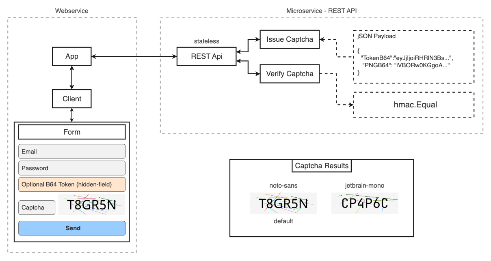
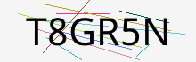
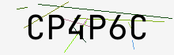

# token-captcha — Stateless CAPTCHA generator and verifier for Go


A lightweight **stateless captcha generator and verifier** written in Go.  
It allows frontend applications to request captchas through an API endpoint  
without any persistent storage or session handling on the server side.

---
## 🚀 Installation


```bash
go get github.com/yousef-muc/token-captcha@v1.0.2
```

[](https://pkg.go.dev/github.com/yousef-muc/token-captcha) 

**Keywords:** go captcha, stateless captcha, hmac token, image verification, ttf font captcha

## 🧠 Overview

`token-captcha` provides a **stateless captcha mechanism** that uses HMAC-SHA256\
to generate and validate captcha tokens without storing any data on the server.

Each token contains:

- A random nonce
- An expiry timestamp
- An action name (to scope usage)
- An HMAC signature based on a secret key

Because the validation uses only the token and user’s answer,\
any server instance can verify a captcha independently — perfect for **distributed systems**\
and **microservices** where shared state is undesirable.

---

## ⚙️ Features

- ✅ Stateless verification (no sessions or DB)
- 🧩 Configurable captcha length, font, size, and noise
- 🖼️ Built-in PNG generation with embedded TTF fonts
- 🔐 HMAC-based integrity and authenticity
- ⏱️ Expiry enforcement and action binding
- 💡 Human-friendly characters (no I, O, 1, 0)

  
---

## 🖥️ Example: Server-side Usage (Go)

Below is a minimal REST API example that issues and verifies captchas.

```go
package main

import (
	"encoding/json"
	"net/http"
	"time"

	"github.com/yousef-muc/token-captcha"
)

func main() {
  // Initialize a new TokenCaptcha service with custom configuration.
	// The secret key is used for HMAC signing, ensuring that issued tokens
	// cannot be tampered with. The captcha length, expiry duration, and
	// rendering options (such as image output and font selection) define
	// how the captcha will be generated and validated.
	svc := tokencaptcha.New(tokencaptcha.Config{
		Secret:        []byte("CHANGE-ME"), // replace with a secure random key in production
		Length:        6,                   // number of captcha characters
		Expiry:        2 * time.Minute,     // token lifetime
		Image:         true,                // enable PNG image generation
    Width:         220,                 // image width in pixels
    Height:        70,                  // image height in pixels
		CaseSensitive: false,               // ignore case during verification
		Font: tokencaptcha.FontConfig{
			Name: "noto-sans", // built-in font name
			Size: 32,          // font size in points
			DPI:  96,          // rendering DPI
		},
	})

	// Endpoint: /captcha/issue
	// Generates and returns a new captcha token, optionally including
	// a base64-encoded PNG image. The "action" parameter in the query
	// string can be used to scope captcha usage to a specific form or API.
	http.HandleFunc("/captcha/issue", func(w http.ResponseWriter, r *http.Request) {
		action := r.URL.Query().Get("action") // optional context for the captcha
		cap, err := svc.IssueCaptcha(action)
		if err != nil {
			http.Error(w, err.Error(), http.StatusInternalServerError)
			return
		}
		// Respond with JSON containing the captcha token and image (if enabled)
		json.NewEncoder(w).Encode(cap)
	})

	// Endpoint: /captcha/verify
	// Accepts a JSON payload with the issued token, the user's answer,
	// and the expected action. The captcha is verified using HMAC
	// validation and expiry checks without any server-side state.
	http.HandleFunc("/captcha/verify", func(w http.ResponseWriter, r *http.Request) {
		var in struct {
			Token  string `json:"token"`  // base64-encoded token returned by /captcha/issue
			Answer string `json:"answer"` // user-provided captcha text
			Action string `json:"action"` // optional action for contextual validation
		}
		// Decode the request body and validate input
		if err := json.NewDecoder(r.Body).Decode(&in); err != nil {
			http.Error(w, err.Error(), http.StatusBadRequest)
			return
		}
		// Verify the captcha; returns true if valid and not expired
		valid := svc.Verify(in.Token, in.Answer, in.Action)
		json.NewEncoder(w).Encode(map[string]any{"valid": valid})
	})

	// Start the HTTP server on port 8080.
	// The API now serves both /captcha/issue and /captcha/verify endpoints.
	http.ListenAndServe(":8080", nil)
}
```

---

## 🌐 Example: Client-side Usage

You can display the captcha image and send user input to the server for verification.

### Request a captcha

```js
async function loadCaptcha() {
  const res = await fetch('/captcha/issue?action=signup');
  const data = await res.json();
  document.querySelector('#captcha-img').src = 'data:image/png;base64,' + data.PNGB64;
  window.captchaToken = data.TokenB64;
}
```

### Submit and verify

```js
async function verifyCaptcha() {
  const answer = document.querySelector('#captcha-answer').value;
  const body = JSON.stringify({
    token: window.captchaToken,
    answer,
    action: 'signup',
  });
  const res = await fetch('/captcha/verify', { method: 'POST', body });
  const data = await res.json();
  alert(data.valid ? 'Captcha passed!' : 'Invalid captcha, try again.');
}
```

### Example HTML

```html

<input id="captcha-answer" placeholder="Enter captcha" />
<button onclick="verifyCaptcha()">Verify</button>
```

---

## ⚙️ Configuration Reference

| Field              | Type            | Description                             |
| ------------------ | --------------- | --------------------------------------- |
| `Secret`           | `[]byte`        | Secret key for HMAC signing             |
| `Length`           | `int`           | Number of characters in captcha text    |
| `Expiry`           | `time.Duration` | Token lifetime before expiration        |
| `Image`            | `bool`          | Whether to generate a PNG image         |
| `Width` / `Height` | `uint16`        | Dimensions of captcha image             |
| `Noise`            | `uint16`        | Number of random noise lines            |
| `CaseSensitive`    | `bool`          | Whether user answers are case-sensitive |
| `AllowActions`     | `[]string`      | Optional list of allowed action names   |
| `FG` / `BG`        | `color.Color`   | Foreground and background colors        |
| `Font`             | `FontConfig`    | Font selection and scaling options      |

### FontConfig

| Field  | Type      | Description                                        |
| ------ | --------- | -------------------------------------------------- |
| `Name` | `string`  | Built-in font name (`noto-sans`, `jetbrains-mono`) |
| `TTF`  | `[]byte`  | Optional custom font data                          |
| `Size` | `float64` | Font size in points                                |
| `DPI`  | `float64` | Dots per inch for rendering                        |

---

## 🔒 Security Notes

- Always set a **unique secret key** via `Config.Secret`.
- Tokens are signed using **HMAC-SHA256**, ensuring integrity and authenticity.
- Expiry timestamps prevent replay attacks.
- Captcha answers are compared in constant time to avoid timing leaks.

---

## 🧩 Why Stateless?

Traditional captchas require storing challenge–response pairs on the server.\
This library embeds all required data (nonce, expiry, action, HMAC) in the token itself.\
Verification can therefore be done by any server instance without shared state or a database.

---


## 🧾 License 

MIT License

Copyright (c) 2025 yousef-muc

Permission is hereby granted, free of charge, to any person obtaining a copy of this software and associated documentation files (the "Software"), to deal in the Software without restriction, including without limitation the rights to use, copy, modify, merge, publish, distribute, sublicense, and/or sell copies of the Software, and to permit persons to whom the Software is furnished to do so, subject to the following conditions:

The above copyright notice and this permission notice shall be included in all copies or substantial portions of the Software.

THE SOFTWARE IS PROVIDED "AS IS", WITHOUT WARRANTY OF ANY KIND, EXPRESS OR IMPLIED, INCLUDING BUT NOT LIMITED TO THE WARRANTIES OF MERCHANTABILITY, FITNESS FOR A PARTICULAR PURPOSE AND NONINFRINGEMENT. IN NO EVENT SHALL THE AUTHORS OR COPYRIGHT HOLDERS BE LIABLE FOR ANY CLAIM, DAMAGES OR OTHER LIABILITY, WHETHER IN AN ACTION OF CONTRACT, TORT OR OTHERWISE, ARISING FROM, OUT OF OR IN CONNECTION WITH THE SOFTWARE OR THE USE OR OTHER DEALINGS IN THE SOFTWARE.
